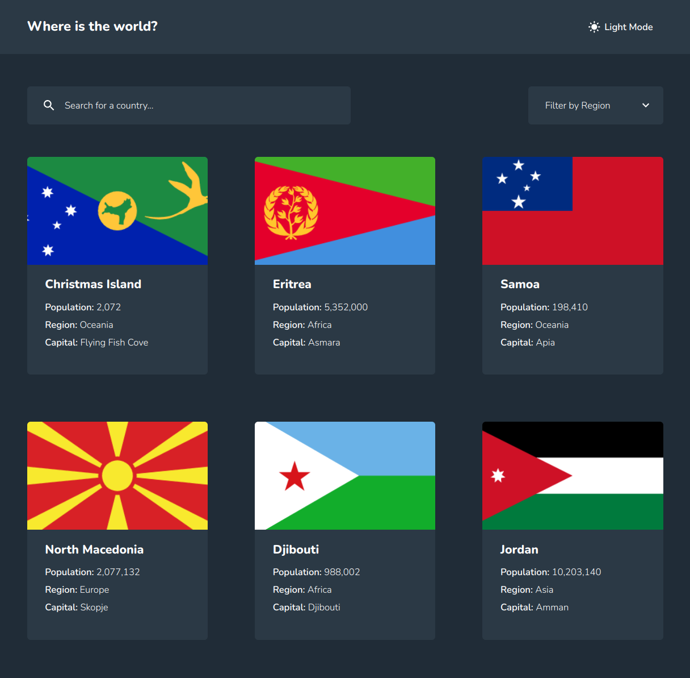
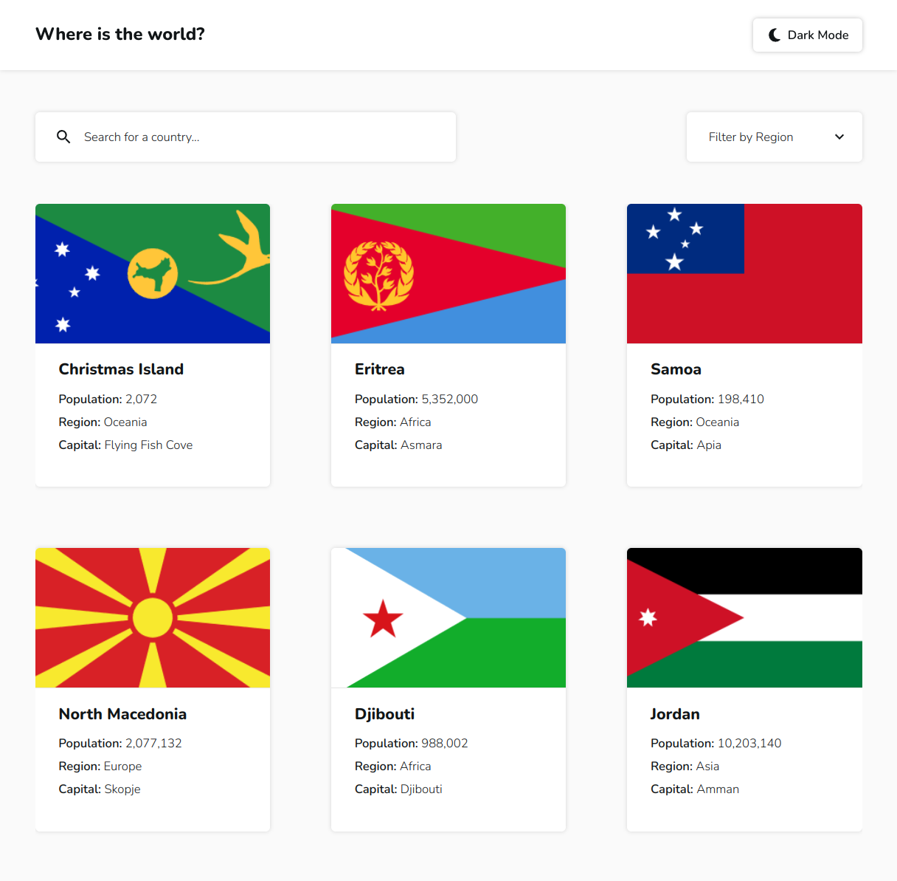
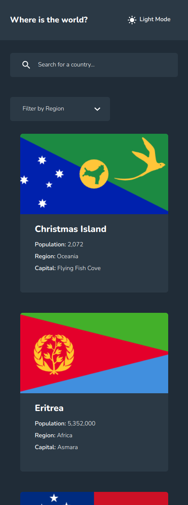
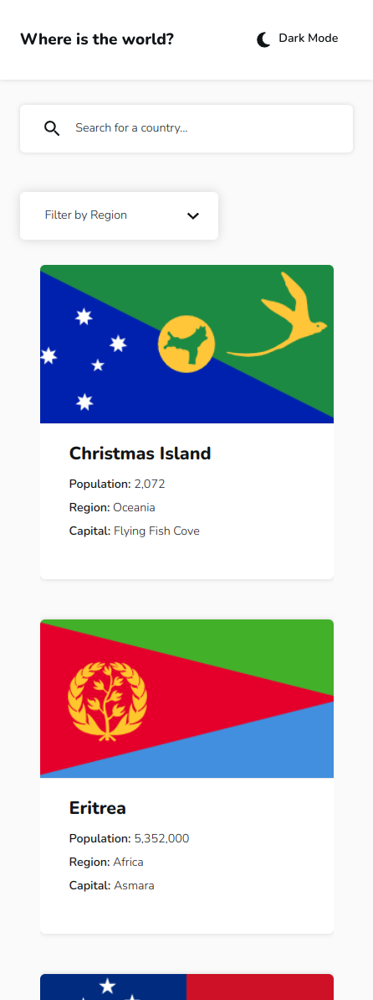
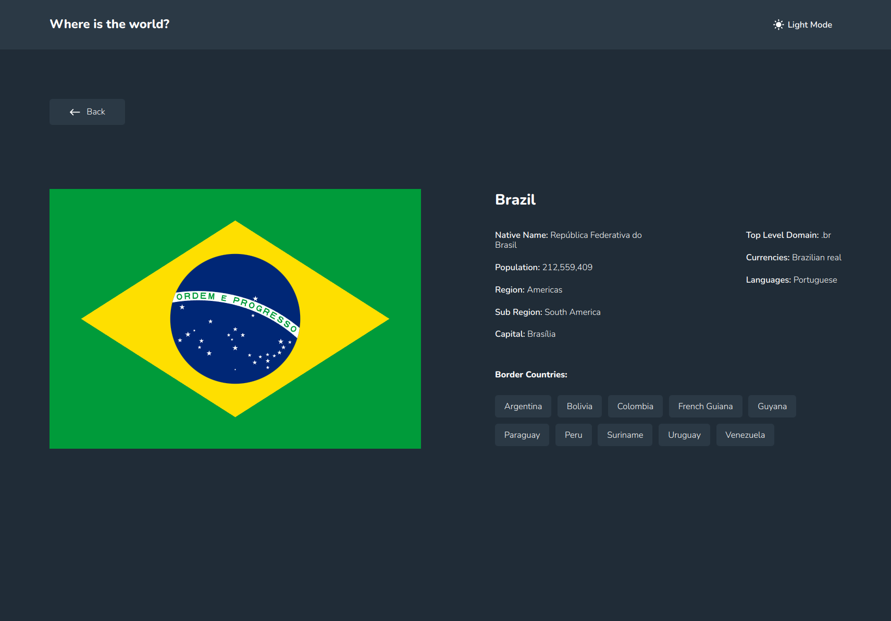
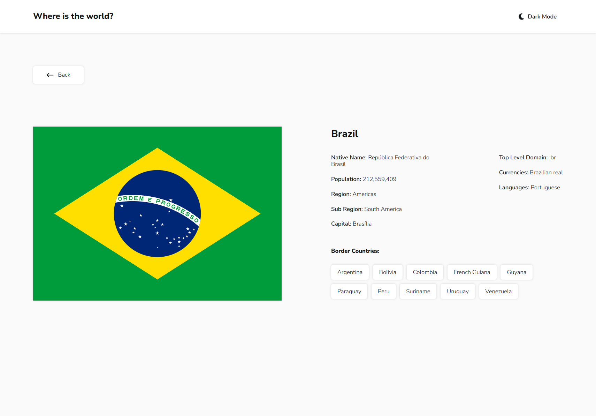
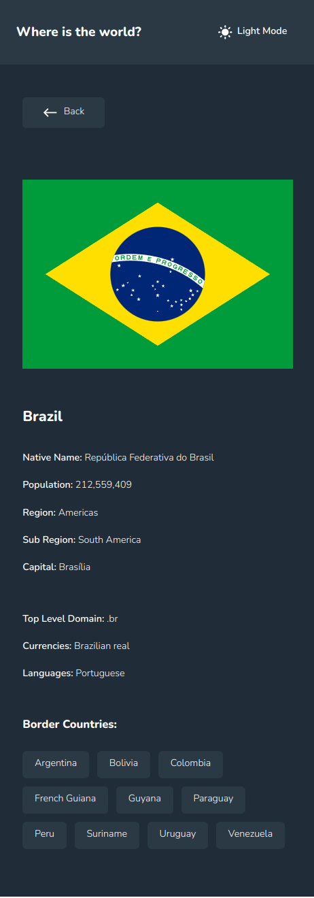
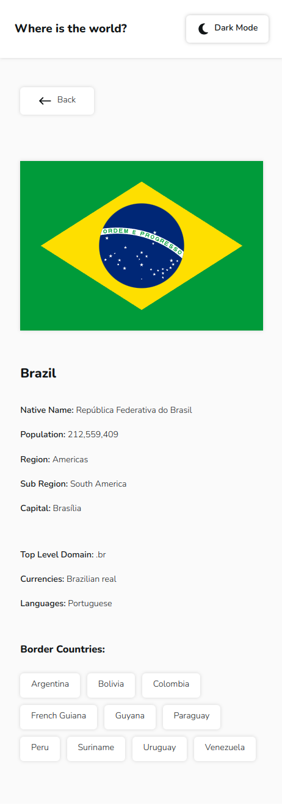

# REST Countries

Simple, easy-to-use application to explore information about the countries and regions of the world.

This is a solution to the [REST Countries challenge on Frontend Mentor](https://www.frontendmentor.io/challenges/rest-countries-api-with-color-theme-switcher-5cacc469fec04111f7b848ca).

## Table of contents

-   [Links](#links)
-   [Screenshots](#screenshots)
-   [Built with](#built-with)
-   [How to run the application](#how-to-run-the-application)
    -   [React Scripts](#react-scripts)
    -   [Docker](#docker)

## Links

-   [Live Demo](https://countries.khodakovsky.com)

## Screenshots













## Built with

-   React
-   React Query
-   NGINX
-   Docker
-   SASS / CSS modules
-   TypeScript

## How to run the application

You can run the application using both Docker and React Scripts.

### React Scripts

Clone this repository:

```console
git clone https://github.com/NikitaKhodakovsky/rest-countries.git
```

Navigate to the directory with this repository:

```console
cd rest-countries
```

Install dependencies:

```console
npm i
```

Run the application:

```console
npm run start
```

The app is now available at http://localhost:3000

### Docker

Install [Docker](https://docs.docker.com/engine/install).

Execute this command to verify that the installation is correct:

```console
docker -v
```

You should see something like this:

```console
Docker version 24.0.7, build afdd53b
```

Clone this repository:

```console
git clone https://github.com/NikitaKhodakovsky/rest-countries.git
```

Navigate to the directory with this repository:

```console
cd rest-countries
```

Execute the following command to start the application from the docker-compose file:

```console
docker compose --env-file ./.env.example up -d
```

The app is now available at http://localhost

<br>

To stop the application run:

```console
docker compose down
```
